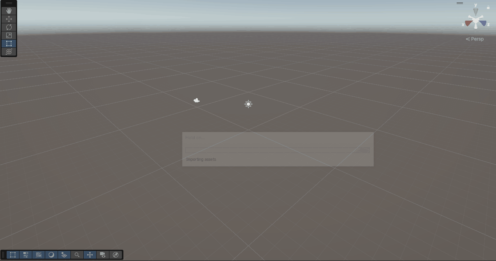
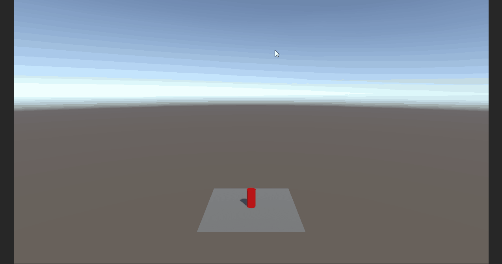
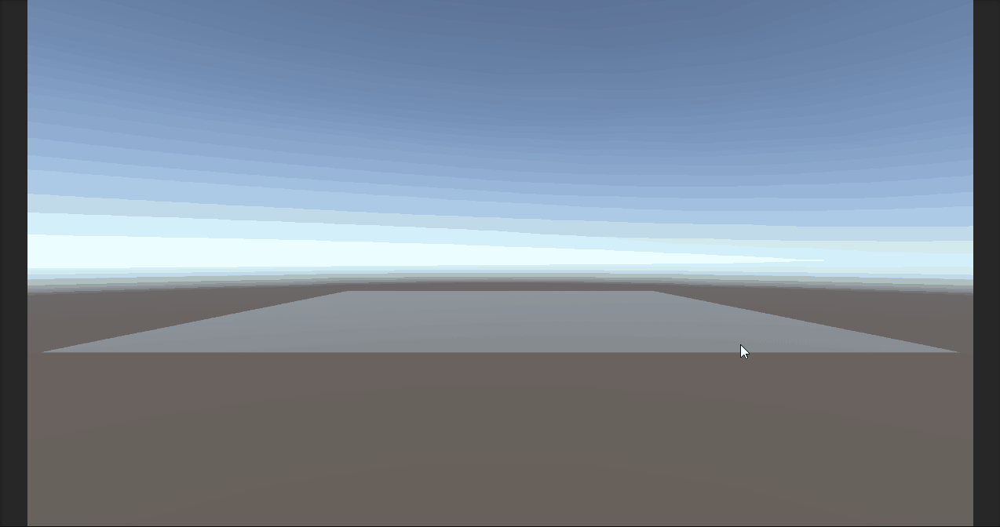

# Opdracht 1

Opdracht 1 

[Script](https://github.com/forestfox08/Prog-P5-J/tree/master/Assets/p5/Scripts/Opdracht1)

# Opdracht 2

Opdracht 2

[Script](https://github.com/forestfox08/Prog-P5-J/tree/master/Assets/p5/Scripts/Opdracht2)

# Opdracht 3

Opdracht 3

[Script](https://github.com/forestfox08/Prog-P5-J/tree/master/Assets/p5/Scripts/Opdracht3)

# Opdracht 4

Scoreboard staat niet op de gif maar dat is nu gefixt!

Opdracht 4

[Script](https://github.com/forestfox08/Prog-P5-J/tree/master/Assets/p5/Scripts/Opdrach4)

# Opdracht 5

Heb gekeken wat het was maar kon het probleem niet identificeren via breakpoints, volgens VS hoort het gewoon te werken. (heel vreemd)

(niet mythe project trouwens, dit is mijn TD game)

## PERIODE 2/M6

# Opdracht 1

Hier zie je opdracht 1, --- TBD ---

